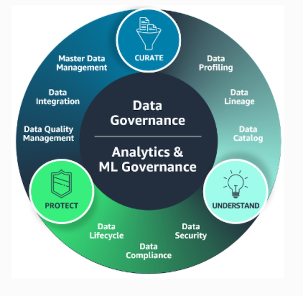
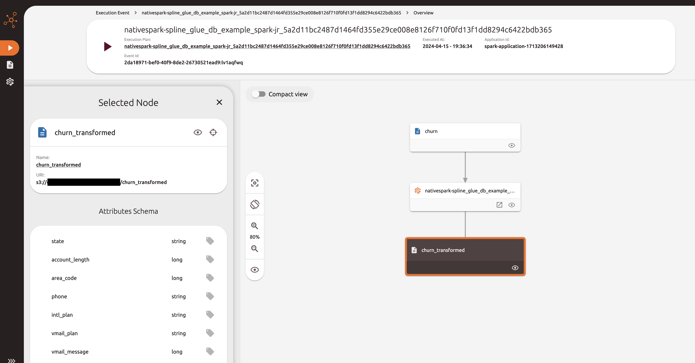
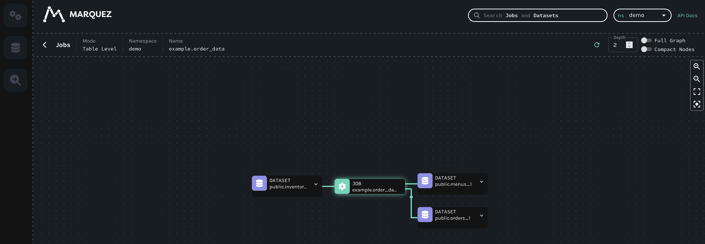

## Data Enablement on AWS Examples

This project aims to give an overview of key data enabling activities. These are governance related objectives, but with a focus on being able to manage and utilize data to deliver business value. 

A high level overview of key data governance capabilities is shown below:  
  
This is taken from [What is Data Governance?](https://aws.amazon.com/what-is/data-governance/).  

We will use these groupings to demonstrate various different activities and their implementation via AWS services in order to help enable your data. 

## Understand

### Data Lineage 

#### Spline Demo

The [spline-demo](./understand/data-lineage/spline-demo/) gives an example of how you can use the [Spline](https://absaoss.github.io/spline/) agent within Python and Spark based AWS Glue jobs to record lineage information. The Spline Python package can be used within AWS Glue Python jobs to send metadata to the Spline service. With AWS Glue Spark jobs, the Spline agent can be included to automatically capture lineage information from the Spark execution plan and send this to the Spline server - without changes to the underlying job code. 

#### Marquez Demo

The [marquez-demo](./understand/data-lineage/marquez-demo/) shows an example deployment of the [Marquez](https://marquezproject.ai/) application on AWS services. This uses an [OpenLineage](https://openlineage.io/) API to capture metadata which can then be visualized in the Marquez UI. In this example, both the Marquez UI and API run on Amazon Elastic Kubernetes Service, and lineage information is persisted within Amazon Relational Database Service. 

## Security

See [CONTRIBUTING](CONTRIBUTING.md#security-issue-notifications) for more information.

## License

This library is licensed under the MIT-0 License. See the LICENSE file.

