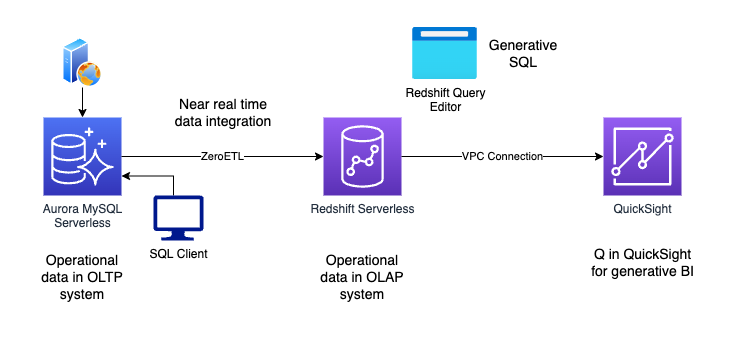

# Data Engineering Demo

## Overview

The purpose of this demo is to show a modern, end-to-end data pipeline on AWS. The solution demonstrates using the zero ETL capability to make source transactional data available for analytics in near real time. Generative AI capabilities are explored to show how productivity can be increased when creating analytical SQL queries and generating visual reports and dashboards. Further, Generative BI is explored to show how business users can ask natural language questions of data. 

| Key capabilities | Description | 
| --- | --- |
| Zero ETL | Shows sending source transactional data from Aurora MySQL to Amazon Redshift for near real time analytics |
| Generative SQL in Amazon Redshift | Explores how natural language can be used to generate Redshift SQL queries to boost productivity in the warehouse | 
| Amazon Q in QuickSight | Demonstrates ways in which Generative BI can be used to assist in dashboard creation, as well as allowing business users to ask natural language questions over data | 

## Architecture 




## Deployment

* Set or replace variables as required in *terraform.tfvars* or equivalent
* Run ```terraform apply```
* After resources have deployed, can create the Zero ETL integration via the console (or similar)
* Then populate the source db with sample data. An easy way of doing this is connecting via a SQL client from an EC2 launched within the same demo VPC, with the self referencing security group associated with it. 
* With the Zero ETL established, can use Redshift Query Editor to explore data and use Generative SQL capabilities. 
* You can connect to Redshift from QuickSight by creating a VPC connection. Can then create dashboards and utilize Q in QuickSight. 

## Clean Up

* Remove the VPC connection created in QuickSight 
* If you customized the EC2 security group or added a new one to allow connections from your local machine, remove this. 
* Remove the Zero-ETL integration
* Run ```terraform destroy```