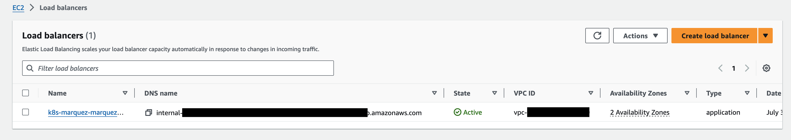
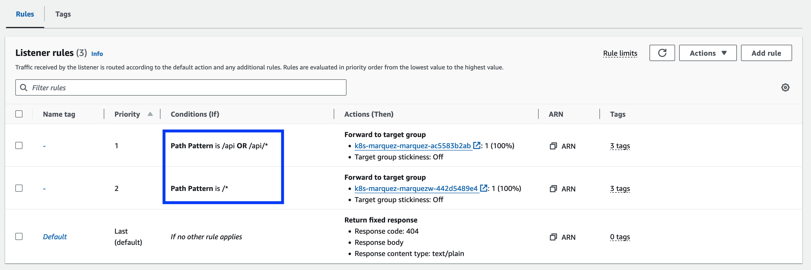
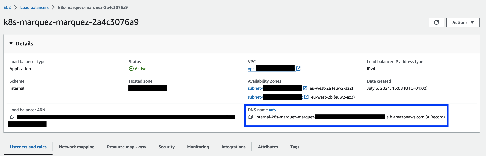
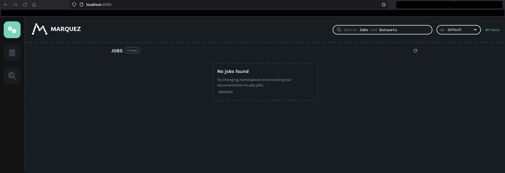

# Data Lineage - Marquez Demo

This example repo provides a demonstration deployment of [Marquez](https://marquezproject.ai/) on AWS. This involves running the Marquez web user interface and API on [Amazon Elastic Kubernetes Service (EKS)](https://aws.amazon.com/eks/) and [Amazon Relational Database Service (RDS)](https://aws.amazon.com/rds/) to store the metadata information. 

## Prerequisites 

To run this example code, you will the following tools installed locally:
* *awscli*
* *python*
* *kubectl*
* *helm*
* [Session manager plugin](https://docs.aws.amazon.com/systems-manager/latest/userguide/session-manager-working-with-install-plugin.html) for the AWS CLI


## Deployment

1. [Deploy Infrastructure](#deploy-infrastructure) - use the sample CDK application to deploy infrastructure to your AWS account.

2. [Deploy Marquez](#deploy-marquez) - once the infrastructure is provisioned, deploy the Marquez kubernetes stack using Helm. 

3. [Explore Marquez](#explore-marquez) - Add metadata information. This demo shows adding some basic metadata information using the [OpenLineage python client](https://openlineage.io/docs/client/python/). 


### Deploy Infrastructure 

* Firstly, make sure you are authenticated with AWS credentials and set your AWS region using profiles, environment variables or similar. 
* Make sure you are in the *understand/data-lineage/marquez-demo* folder ```cd understand/data-lineage/marquez-demo```. 
* Create a python virtual environment and activate it (optional), then install the required packages. 

```
source .venv/bin/activate
pip install -r requirements.txt
```

* The stack will deploy an EC2 instance that you will use for accessing the Marquez UI. The instance is deployed into a private subnet and you will use AWS Systems Manager to connect to the instance to run the Python client and also for port forwarding so you can access the Marquez UI from your local machine. In order to allow this, you must specify an EC2 SSH key to use, ensure you have the private key locally and then pass the EC2 key name as a parameter variable

```
cdk deploy --parameters KeyPairName=<your_ec2_key_pair_name>
```

See [Create a key pair for your Amazon EC2 instance](https://docs.aws.amazon.com/AWSEC2/latest/UserGuide/create-key-pairs.html) for more information on this step. 

After the stack has deployed, there is some additional configuration required for the EKS cluster so that you can manage the cluster using your AWS IAM credentials. This demo will show updating to give your IAM principal cluster wide, admin credentials. This is for the purpose of the demo only. 

When first deployed, the EKS Cluster uses ConfigMap access only. Update this to use ConfigMap and EKS API, and add the IAM principal you will use to administer the cluster. See https://docs.aws.amazon.com/eks/latest/userguide/access-entries.html for more information. 

You will use your cluster name in the next few commands so it is useful to set it as a variable.
```
CLUSTER_NAME=<your_cluster_name>
```
**NOTE:** your cluster name is given as an output from the CDK stack. 

```
aws eks update-cluster-config --name $CLUSTER_NAME --access-config authenticationMode=API_AND_CONFIG_MAP
```
**NOTE:** If you get an error about *access-config* being an unrecognised command, make sure you have the latest AWS CLI version. 

You now need to create an access entry for the IAM principal you will use. It is recommended to use an IAM role. For this demo, you can pass the ARN of the IAM principal you are authenticated as, for example the ARN of the IAM role you may be assuming. 
```
aws eks create-access-entry --cluster-name $CLUSTER_NAME --principal-arn <your_iam_principal_arn>
```

Finally, associate an access policy to the IAM principal. 

```
aws eks associate-access-policy --cluster-name $CLUSTER_NAME \
  --principal-arn <your_iam_principal_arn> \
  --access-scope type=cluster \
  --policy-arn arn:aws:eks::aws:cluster-access-policy/AmazonEKSClusterAdminPolicy
```

You can now update your local kubeconfig so that you can interact with the EKS cluster using local kubectl. 
```
aws eks update-kubeconfig --name $CLUSTER_NAME
```

You should now be able to run commands such as ```kubectl get namespaces``` against your EKS cluster. 

### Deploy Marquez 

To deploy Marquez, this demo will show the process of deploying the Helm chart from the [Marquez Project GitHub](https://github.com/MarquezProject/marquez/tree/main/chart). 

* First, create a namespace. Our EKS Fargate profile expects the namespace to be *marquez*, so if you want to change it, be sure to override the namespace selector parameter in the CDK stack. 

```
kubectl create namespace marquez
```

* Before you deploy the Helm chart, get the RDS database credentials that were stored securely in AWS Secrets Manager by the CDK stack. Use the AWS CLI to retrieve the secret string, and then use the information from within this string to set the corresponding variables, as below.
 
```
aws secretsmanager get-secret-value --secret-id <your_secret_id> --query SecretString --output text
```

**NOTE** The secret id is the secret ARN output from the cdk stack. 

Now from the string, pick out the required pieces of information to set environment variables for the RDS credentials. 
```
export AWS_RDS_PASSWORD="<your_password>"
export AWS_RDS_HOST=<your_host>
export AWS_RDS_USERNAME=marquez
```

* To deploy Marquez, you can use their Helm chart. Add the required repo dependencies if not already. 
```
helm repo add bitnami https://charts.bitnami.com/bitnami
```

* Currently, the Helm chart is only available from the GitHub repo, so clone the repo, change directory into the chart folder, then run the Helm commands. 
```
git clone git@github.com:MarquezProject/marquez.git
cd marquez/chart
helm dependency build
```

* You are now ready to deploy the Helm chart. In the below, this demo shows adding Ingress annotations to deploy an internal application load balancer for accessing the Marquez UI and API. 
* The deployment is kept internal since, by default the services run on HTTP and so traffic is not encrypted in transit. In a non-demo deployment, HTTPS should be used. 
* For this demo, the services are kept internal, and the EC2 instance is used to connect and forward ports for local access. To allow this, there is also an annotation to specify the security group that will allow access from the EC2 instance. 
* The relevant EC2 security group id can be retrieved from the CDK stack output. 
```
helm upgrade --install marquez . \
  --set marquez.db.host=$AWS_RDS_HOST \
  --set marquez.db.user=$AWS_RDS_USERNAME \
  --set marquez.db.password=$AWS_RDS_PASSWORD \
  --set ingress.enabled=true \
  --set ingress.annotations."alb\.ingress\.kubernetes\.io/scheme"=internal \
  --set ingress.annotations."alb\.ingress\.kubernetes\.io/target-type"=ip \
  --set ingress.annotations."alb\.ingress\.kubernetes\.io/security-groups"=<your_security_group_id> \
  --set ingress.annotations."alb\.ingress\.kubernetes\.io/manage-backend-security-group-rules"=true \
  --set ingress.hosts[0]='*.amazonaws.com' \
  --set ingress.className=alb \
  --namespace marquez
```

**NOTE** Be sure to update the above command with your security group id. 

* This demo will show accessing the Marquez UI from your local environment. To do this, we need to update the load balancer listener rules. Go to the EC2 console, select Load Balancers and select your K8s marquez load balancer. 


* After selecting the load balancer, select *Listeners and rules* tab, then click on the *3 rules*. 


* Edit the first two rules to remove only the *HTTP Host Header* condition. 

* Your new rules should now look like the below. 


**NOTE** Again, this is only for demo purposes. 

* OPTIONAL: You can also modify the marquez api target group to ensure health checks pass. Click on the target group, go to the *Health checks* tab, then edit the health check path to */api/v1/namespaces*. This should mean that a healthy status is reported when your Marquez service is running. 

* Now that your configuration is complete, you can SSH onto your EC2 instance. Because the instance is in a private subnet, this demo shows using SSM to connect. You can use an SSH config similar to the below to set this up
```
Host marquez
	HostName <your_ec2_instance_id>
	LocalForward 8080 <your_load_balancer_endpoint>:80
	User ec2-user
	IdentityFile <path_to_SSH_key>
	ProxyCommand aws ssm start-session --target %h --document-name AWS-StartSSHSession

```

**NOTE** You can get the EC2 instance id from the CDK stack output. The Load balancer endpoint can be retrieved from the EC2 Load Balancer page in the AWS console, under *DNS name* as shown below. 


* Once the SSH configuration is set, start the SSH session ```ssh marquez```. This will give a shell on the EC2 instance as well as start the port forwarding. 

* You should now be able to visit *localhost:8080* in your local browser and view the Marquez UI. And if you visit *localhost:8080/api/v1/namespaces* (or similar), you can start interacting with the API. 


* Next, the demo will show using the OpenLineage python client to create and record some sample metadata. 


### Explore Marquez

When connected to your EC2 instance, first install pip and the OpenLineage python package. 

```
sudo yum install python3-pip
pip3 install openlineage-python
```

Then create a file called generate_events.py and add the below contents. Ensure you add your Load Balancer endpoint. You can do this using ```nano generate_events.py```.

```python
from openlineage.client import OpenLineageClient
from openlineage.client.run import RunEvent, RunState, Run, Job, Dataset
import uuid
from datetime import datetime

client = OpenLineageClient(url="http://<your_load_balancer_endpoint>:80")
producer = "demo_producer"

inventory = Dataset(namespace="demo", name="public.inventory")
menus = Dataset(namespace="demo", name="public.menus_1")
orders = Dataset(namespace="demo", name="public.orders_1")

job = Job(namespace="demo", name="example.order_data")
run = Run(str(uuid.uuid4()))

client.emit(
    RunEvent(
        RunState.START,
        datetime.now().isoformat(),
        run, job, producer
    )
)

client.emit(
    RunEvent(
        RunState.COMPLETE,
        datetime.now().isoformat(),
        run, job, producer,
        inputs=[inventory],
        outputs=[menus, orders],
    )
)
```

Save the file, then run ```python3 generate_events.py```. This should generate some very basic data. 

**NOTE** The above python code should be run from your EC2 instance, not locally. Because the load balancer is internal only, the API is not available externally. 

Navigate back to *localhost:8080* and you can explore the data added in the Marquez UI. 


You can now explore integrating data collection from other tools and across workloads!

## Remove resources

After running through the demo, be sure to remove resources no longer required. From your local workstation, run:
```
helm uninstall marquez -n marquez
```

And from the *understand/data-lineage/marquez-demo* folder
```
cdk destroy
```