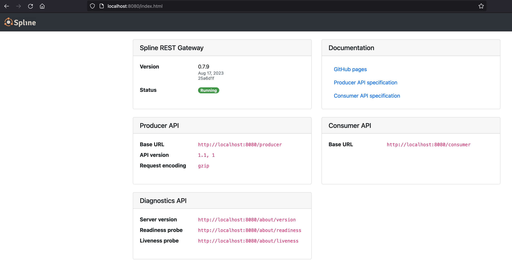
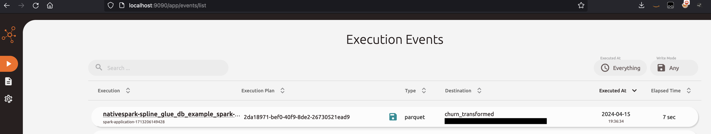
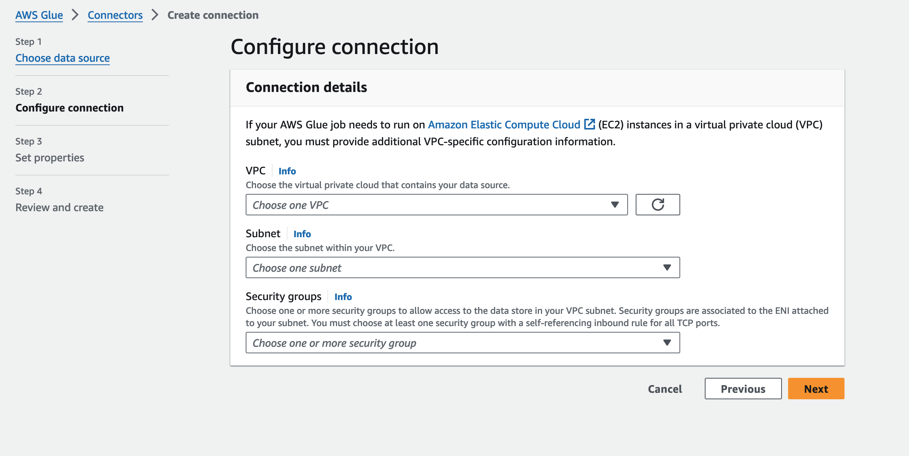
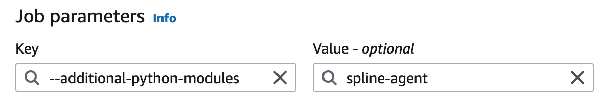
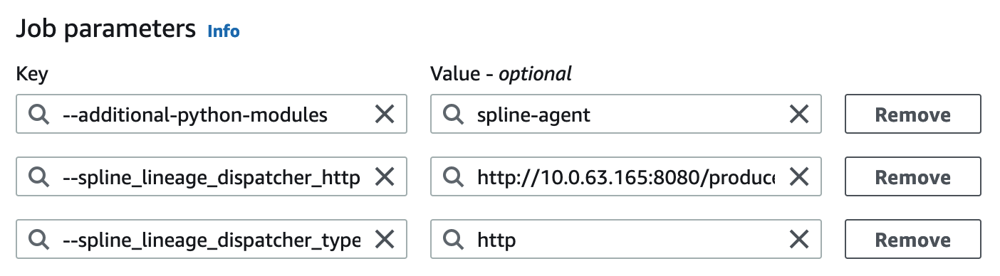
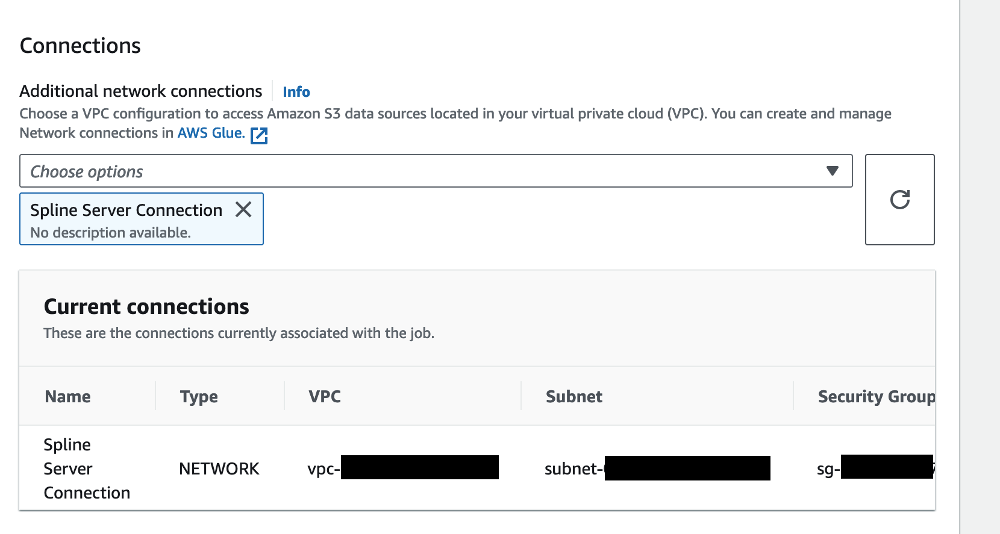
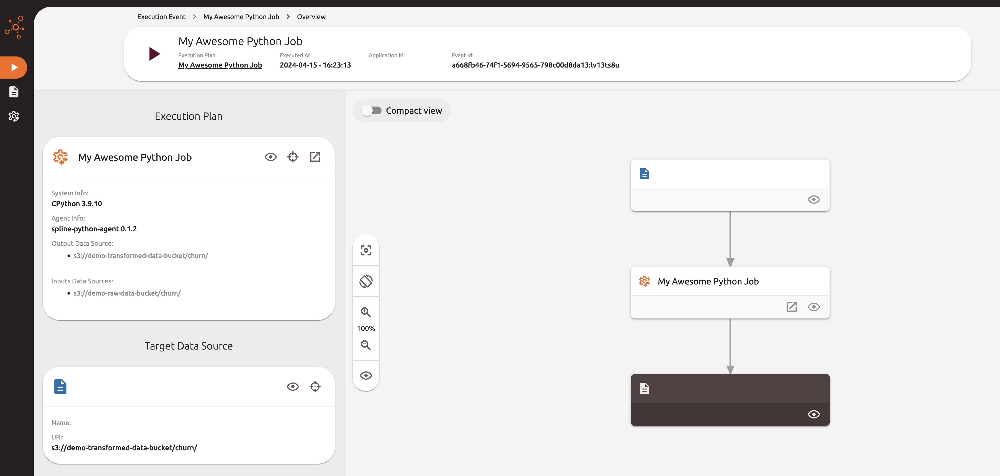
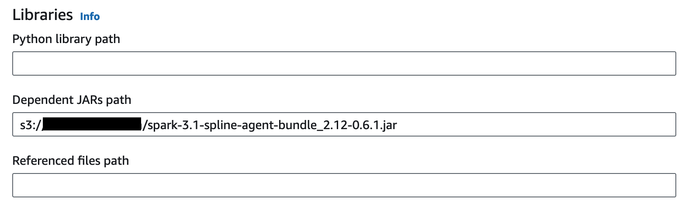

# Data Enablement - Data Lineage with Spline

## Spline

[Spline](https://absaoss.github.io/spline/) is an open source tool for automated tracking of data lineage and data pipelines. Originally developed for specifically tracking Apache Spark jobs (Spark lineage -> Spline). 

## Deployment

To demo use of Spline, the CDK application deploys a VPC with related resources and an EC2 instance where the Spline server and related resources are installed and run with docker-compose as outlined in the [spline-getting-started docs](https://github.com/AbsaOSS/spline-getting-started/tree/main/spline-on-AWS-demo-setup). 

The EC2 [user data](./spline/user_data.sh) automates the install of required tools/software and starts the spline services. The EC2 instance is launched in a private subnet and we connect using AWS Systems Manager. 

The install script can be modified to use a public IP of the instance so that this can be passed as an argument when starting Spline services, allowing for external connections if this was needed. This would also require modification of the CDK infra to launch into a public subnet and to update the associated Security Group to allow connections. 

In order to connect, we will use SSM with local port forwarding for multiple ports (one for the Spline REST gateway and another for the Spline UI). So specify an EC2 key pair that you can associate with the instance and that you have locally so that you can connect to the instance. 

Deploy by running:
```
cdk deploy --parameters KeyPairName=<your_ec2_key_pair_name>
```

See [cleanup](#cleanup) after you have finished with the demo to remove related resources.  

## Using Spline

* [Connecting to Spline UIs](#connecting-to-spline-uis)
* [Running with AWS Glue](#running-with-aws-glue)
  * [Create an AWS Glue Connection](#create-an-aws-glue-connection)
  * [AWS Glue Python Job Example](#aws-glue-python-job-example)
  * [AWS Glue Spark Job Example](#aws-glue-spark-job-example)

### Connecting to Spline UIs

Once the Spline EC2 instance is running, we can connect to the user interfaces from a local machine using SSH config like below: 

```
Host spline
	HostName <EC2_instance_id>
	LocalForward 8080 localhost:8080
	LocalForward 9090 localhost:9090
	User ec2-user
	IdentityFile <path_to_ssh_key>
	ProxyCommand aws ssm start-session --target %h --document-name AWS-StartSSHSession
```

Be sure to use your EC2 instance id and a path to the SSH key used when creating the EC2 instance in the above. Start the session by running ```ssh spline```. This will give you a terminal on your EC2 instance as well as starting the port forwarding. 

We can then visit localhost:8080 to view the Spline REST Gateway


And localhost:9090 to view the Spline UI

The screenshot shown has had a record added to it from a Spark job. 

### Running with AWS Glue 

#### Create an AWS Glue Connection 

As part of tracking lineage information from our AWS Glue jobs, we will be sending metadata from Glue to our spline server, currently running on our EC2 instance. To allow this, we must create an AWS Glue Connection with the NETWORK connector type. 



* For VPC, choose the VPC the Spline Server EC2 instance is deployed into
* Likewise for Subnet
* For Security Group, choose the same, self-referencing security group that is associated with the EC2 instance. 

#### AWS Glue Python Job Example 

We use the [spline-python-agent](https://github.com/AbsaOSS/spline-python-agent) to decorate python functions within the AWS Glue script. This allows the specification of job details, such as name, input datasets and output. We will create the Job using the script editor in Glue Studio. 

The [spline-agent](https://pypi.org/project/spline-agent/) Python package is not already included with AWS Glue, so we must install it by specifying this as an additional python module in the job parameters:



We must also pass configuration, which is typically done via environment variables, to configure where and how the agent will send lineage information. We pass these in as job parameters and set them as environment variables in the job script. 

```
SPLINE_LINEAGE_DISPATCHER_TYPE=http
SPLINE_LINEAGE_DISPATCHER_HTTP_BASE_URL=http://<spline-ec2-private-ip>:8080/producer
```

So Job Parameters should now look similar to the below: 


Use the private IP address of the EC2 instance (where Spline is running) for the dispatcher url. To allow network connectivity from AWS Glue to our VPC resource, this is where we use the Glue Connection created earlier. This can be specified in the Connections section of the AWS Glue job as below:



We can then write our Python script to retrieve, process and write data. We decorate our function to provide the lineage information to Spline. 

An example script is as below:
```python
import sys
import spline_agent
from spline_agent.enums import WriteMode
import awswrangler as wr
from awsglue.utils import getResolvedOptions
import os

# get arguments passed as job parameters
args = getResolvedOptions(sys.argv, ['spline_lineage_dispatcher_type', 'spline_lineage_dispatcher_http_base_url'])
spline_lineage_dispatcher_type = args['spline_lineage_dispatcher_type']
spline_lineage_dispatcher_http_base_url = args['spline_lineage_dispatcher_http_base_url']

print(spline_lineage_dispatcher_type)
print(spline_lineage_dispatcher_http_base_url)

# set as environment variables to be picked up by the Spline agent
os.environ["SPLINE_LINEAGE_DISPATCHER_TYPE"] = spline_lineage_dispatcher_type
os.environ["SPLINE_LINEAGE_DISPATCHER_HTTP_BASE_URL"] = spline_lineage_dispatcher_http_base_url

# use decorators to set the spline lineage information
@spline_agent.track_lineage(name = "My Awesome Python Job")
@spline_agent.inputs('{input_source}')
@spline_agent.output('{output_source}', WriteMode.OVERWRITE)
def my_example_func(input_source, output_source):
    print("Reading from ", input_source)
    # in this case, reading a csv using the AWS SDK for pandas
    df = wr.s3.read_csv(input_source)
    
    print("Writing to ", output_source)
    wr.s3.to_parquet(df, path=output_source, index=False, dataset=True)

# set input and output locations, in this example, both using S3
my_example_func('s3://<input_prefix>/', 's3://<output_prefix/')
print("Done")
```

After the job runs, you can view details in the Spline UI


#### AWS Glue Spark Job Example

The [spline-spark-agent](https://github.com/AbsaOSS/spline-spark-agent) works in a similar way to the Python agent, capturing execution plans and lineage information from Spark. We can also set it up with a codeless initialization, meaning decorators and manual editing doesn't need to be made to the job script. 

To use the Spark agent, we must include the jar relevant to our Spark version. This example will show an AWS Glue 3.0 job which supports Spark 3.1. We will create the Job using the script editor in Glue Studio. You will need to select a role that Glue can assume in order to conduct the job, so ensure it has relevant permissions such as being able to read/write to and from your data sources. 

You can download the relevant Jar from [mvn repo](https://mvnrepository.com/artifact/za.co.absa.spline.agent.spark/spark-3.1-spline-agent-bundle_2.12/0.6.1), upload this to Amazon S3, then in the Libraries section of the Glue Job, specify the location of the jar. 


Similar to the Python job, again use the AWS Glue Connection so that the job can write to our Spline server running on EC2. 

We can then pass in parameters to configure Spark to send metadata to Spline. 
In Job Parameters, set the below: 

*Key:* --conf  
*Value:* spark.spline.lineageDispatcher.http.producer.url=http://<EC2_Private_IP>:8080/producer --conf spark.sql.queryExecutionListeners=za.co.absa.spline.harvester.listener.SplineQueryExecutionListener

Because we are setting multiple conf options, specify the additional conf information in the same value field.   
For the ```spark.spline.lineageDispatcher.http.producer.url```, use the private IP address of your EC2 Spline Server instance.  

This configures our job to use information from our Spark SQL job. 

Further set the Job Parameter:  
*Key:* --user-jars-first  
*Value:* true

By default, the AWS Glue job will use the Glue data catalog as the Hive metastore. This allows us to reference tables in our Spark SQL job as below: 

```python
import sys
from awsglue.transforms import *
from awsglue.utils import getResolvedOptions
from pyspark.context import SparkContext
from awsglue.context import GlueContext
from awsglue.job import Job

## @params: [JOB_NAME]
args = getResolvedOptions(sys.argv, ['JOB_NAME'])

sc = SparkContext()
glueContext = GlueContext(sc)
spark = glueContext.spark_session
job = Job(glueContext)
job.init(args['JOB_NAME'], args)

# select the Glue database
spark.sql("use <your_glue_db>;")

df = spark.sql("select * from <your_table>")

df.write.format("parquet") \
    .option("path", "s3://<output_prefix>/") \
    .mode("overwrite") \
    .saveAsTable("<output_glue_table_name>")

job.commit()
```

Fill in the above relevant values according to your scenario. 

Then after the job has run, we can view lineage information in the Spline UI as below:


As we can see, the job lineage has been captured. You can select nodes in the graph and view additional information, such as the schema. 

## Cleanup

Once you have finished with the demo, you can delete the related resources by running ```cdk destroy```. 

Further, you can also: 
* remove the AWS Glue Network connection
* remove the spline Jar in Amazon S3